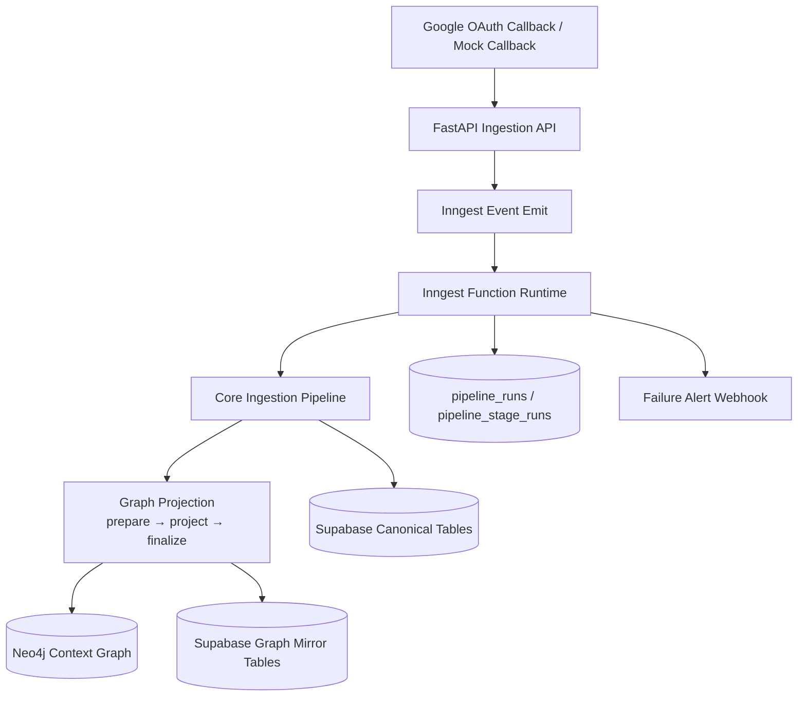
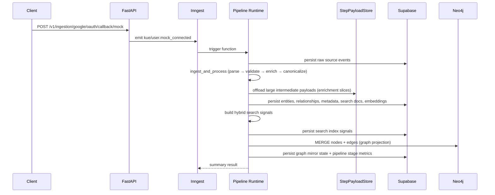

# kue-intelligence

Kue Intelligence is a FastAPI + Inngest data-intelligence service that converts raw contact and communication signals into canonical records, entities, relationships, semantic documents, embeddings, hybrid search signals, and graph projections — all observable, replay-safe, and tenant-scoped.

Focused ingestion documentation: [`docs/INGESTION_PIPELINE.md`](docs/INGESTION_PIPELINE.md)

---

## Table of Contents

1. [Product Context](#1-product-context)
2. [High-Level Architecture](#2-high-level-architecture)
3. [Runtime Flow](#3-runtime-flow)
4. [Pipeline Stages](#4-pipeline-stages)
5. [Inngest Module Layout](#5-inngest-module-layout)
6. [Data Stores](#6-data-stores)
7. [Repository Structure](#7-repository-structure)
8. [Local Development](#8-local-development)
9. [Environment Variables](#9-environment-variables)
10. [Inngest Setup](#10-inngest-setup)
11. [API Endpoints](#11-api-endpoints)
12. [Example Calls](#12-example-calls)
13. [Graph Projection](#13-graph-projection)
14. [Observability](#14-observability)
15. [Migrations](#15-migrations)
16. [Tests](#16-tests)
17. [CI](#17-ci)
18. [Troubleshooting](#18-troubleshooting)
19. [Security](#19-security)

---

## 1) Product Context

Kue turns fragmented professional data into relationship intelligence:

- **NLP search** — `"Who do I know at Stripe?"`
- **Relationship strength ranking** — weighted by interaction frequency and recency
- **Warm-intro path discovery** — shortest path through the contact graph
- **Temporal context** — `last_contacted`, full interaction history

**System truth model:**
- **Postgres / Supabase** is the canonical source of truth
- **Neo4j graph** is a derived, fully re-projectable view

---

## 2) High-Level Architecture



---

## 3) Runtime Flow



---

## 4) Pipeline Stages

Each stage is tracked individually in `pipeline_stage_runs` with status, duration, and record counts.

| # | Stage key | Inngest step(s) | Description |
|---|-----------|-----------------|-------------|
| 1 | `intake` | `validate_payload`, `fetch_google` / `fetch_mock` | OAuth / mock source fetch |
| 2 | `orchestration` | `ensure_run`, `complete_run`, `fail_run` | Pipeline run lifecycle |
| 3 | `raw_capture` | `validate`, `persist` | Validate and persist raw source events (skipped for pre-stored paths) |
| 4 | `canonicalization` | `ingest_and_process` | Fetch → parse → validate → enrich → canonicalize in one consolidated step |
| 5 | `entity_resolution` | `persist_entities` | Upsert resolved entity + identity records |
| 6 | `metadata_extraction` | `persist_metadata` | Upsert entity metadata tags |
| 7 | `semantic_prep` | `persist_search_documents` | Persist semantic search documents |
| 8 | `embedding` | `generate_vectors`, `persist_vectors` | Generate and store embedding vectors |
| 9 | `search_indexing` | `build_signals`, `index_health_check` | Build hybrid signals and apply to search index |
| 10 | `relationship_extraction` | `persist_relationships` | Persist interaction facts and relationship aggregates |
| 11 | `graph_projection` | `prepare`, `project`, `finalize` | Snapshot → Neo4j upsert → mirror state |

### Graph Projection Detail

**`prepare`** — ensures Neo4j schema constraints/indexes, fetches projection inputs from Supabase, builds snapshot + batch stats + checksum.

**`project`** — upserts nodes (`Person`, `User`, `Company`, `Topic`) and edges (`KNOWS`, `INTERACTED_WITH`, `WORKS_AT`, `MEMBER_OF`, `HAS_TOPIC`, `INTRO_PATH`).

**`finalize`** — verifies graph counts against expected snapshot, persists mirror state to Supabase graph projection tables.

---

## 5) Inngest Module Layout

`runtime.py` was refactored from a single 1,378-line file into focused modules:

| Module | Lines | Responsibility |
|--------|-------|----------------|
| `app/inngest/client.py` | ~67 | `inngest_client` setup, cached `_pipeline_store` / `_step_payload_store`, `_alert_on_failure` |
| `app/inngest/operations.py` | ~528 | All pure domain functions — validate, fetch, parse, persist, enrich, embed, graph, etc. |
| `app/inngest/layers.py` | ~234 | `_run_layer_internal` dispatch dict + `_layer_*` wrappers + `_mark_run_*` |
| `app/inngest/pipeline.py` | ~233 | `_run_post_ingest_steps`, `_build_pipeline_summary`, `_run_pipeline_core` |
| `app/inngest/runtime.py` | ~139 | Inngest function decorators and `inngest_functions` export only |

### Inngest Functions

| Function ID | Trigger event | Entry point |
|-------------|--------------|-------------|
| `ingestion-pipeline-run` | `pipeline/run.requested` | `ingestion_pipeline_run` |
| `ingestion-user-connected` | `kue/user.connected` | `ingestion_user_connected` |
| `ingestion-user-mock-connected` | `kue/user.mock_connected` | `ingestion_user_mock_connected` |
| `ingestion-stage-canonicalization-replay` | `pipeline/stage.canonicalization.replay.requested` | `replay_canonicalization` |

---

## 6) Data Stores

### Supabase (Canonical + Observability)

| Table | Purpose |
|-------|---------|
| `raw_events` | Raw captured source events |
| `canonical_events` | Parsed + normalized events |
| `entities` | Resolved entity records |
| `entity_identities` | Per-source identity linkage |
| `relationships` | Aggregated relationship strengths |
| `interaction_facts` | Raw interaction records |
| `search_documents` | Semantic documents for hybrid search |
| `step_payloads` | Offloaded large intermediate pipeline payloads |
| `pipeline_runs` | Per-run lifecycle and status |
| `pipeline_stage_runs` | Per-layer status, duration, record counts, errors |
| `ai_call_logs` | Schema-ready for LLM call logging |
| `graph_projection_runs` | Graph projection run metadata |
| `graph_projection_nodes` | Mirror of projected node counts by label |
| `graph_projection_edges` | Mirror of projected edge counts by type |

### Neo4j (Derived Context Graph)

**Node labels:** `Person`, `User`, `Company`, `Topic`

**Relationship types:** `KNOWS`, `INTERACTED_WITH`, `WORKS_AT`, `MEMBER_OF`, `HAS_TOPIC`, `INTRO_PATH`

Neo4j is **optional** — if unconfigured, all graph stages use a safe no-op store and the pipeline still completes successfully.

### StepPayloadStore

Large intermediate results (enrichment slices, embedding vectors) are offloaded to `step_payloads` (Supabase) or a local SQLite fallback, avoiding Inngest's step result size limits. Steps receive a `ref` string and read the payload on demand.

---

## 7) Repository Structure

```text
app/
├── main.py                          # FastAPI app entry point
├── schemas.py                       # Shared Pydantic schemas
├── api/
│   └── ingestion_routes.py          # All REST endpoints
├── core/
│   └── config.py                    # Settings / env model (pydantic-settings)
├── ingestion/
│   ├── parsers.py                   # Raw → canonical event parsing
│   ├── validators.py                # Post-parse validation
│   ├── enrichment.py                # Cleaning + enrichment transforms
│   ├── entity_resolution.py         # Entity candidate extraction + merging
│   ├── metadata_extraction.py       # Tag/metadata extraction
│   ├── relationship_extraction.py   # Interaction + relationship strength
│   ├── semantic_prep.py             # Semantic document construction
│   ├── embeddings.py                # Embedding request building + generation
│   ├── search_indexing.py           # Hybrid signal construction
│   ├── raw_store.py                 # Raw event persistence (Supabase)
│   ├── canonical_store.py           # Canonical event persistence
│   ├── entity_store.py              # Entity + identity upsert
│   ├── relationship_store.py        # Relationship + interaction persistence
│   ├── search_document_store.py     # Semantic document persistence
│   ├── embedding_store.py           # Embedding vector persistence
│   ├── search_index_store.py        # Hybrid index signal persistence
│   ├── pipeline_store.py            # pipeline_runs + pipeline_stage_runs
│   ├── step_payload_store.py        # Large payload offload store
│   ├── graph_store.py               # Neo4j graph store (or no-op)
│   ├── graph_projection.py          # Snapshot builder + mirror persistence
│   ├── google_connector.py          # Google OAuth + mock connector
│   ├── connectors.py                # Connector registry
│   ├── admin_reset.py               # Admin reset logic
│   └── cache_registry.py            # Embedding cache registry
└── inngest/
    ├── client.py                    # Inngest client, store accessors, alert hook
    ├── operations.py                # Domain operation functions
    ├── layers.py                    # Layer dispatch + wrappers
    ├── pipeline.py                  # Core pipeline orchestration
    └── runtime.py                   # Inngest function definitions

supabase/
└── migrations/                      # Ordered SQL migrations

tests/                               # Pytest test suite (per-layer + integration)

.github/
├── CODEOWNERS                       # @ItsHarun owns all files
└── workflows/
    └── ci.yml                       # GitHub Actions CI
```

---

## 8) Local Development

### Prerequisites

- Python 3.11+
- [`uv`](https://github.com/astral-sh/uv) package manager
- Supabase project (or run with SQLite fallback for local-only)
- Inngest account + Dev Server (`npx inngest-cli@latest dev`)
- Neo4j Aura or local Neo4j *(optional)*

### Install `uv`

```bash
curl -LsSf https://astral.sh/uv/install.sh | sh
```

If `uv` is not found after install:

```bash
echo 'export PATH="$HOME/.local/bin:$PATH"' >> ~/.zshrc
source ~/.zshrc
```

### Install dependencies

```bash
uv sync --group dev
```

### Configure environment

```bash
cp .env.example .env
# Edit .env with your values
```

### Start the API

```bash
uv run uvicorn app.main:app --reload --host 0.0.0.0 --port 8000
```

### Run tests

```bash
uv run pytest
```

### Makefile shortcuts

```bash
make sync   # uv sync --group dev
make run    # start uvicorn
make test   # uv run pytest
make lock   # uv lock
```

---

## 9) Environment Variables

| Variable | Required | Default | Description |
|----------|----------|---------|-------------|
| `APP_ENV` | No | `development` | Environment name |
| `APP_HOST` | No | `0.0.0.0` | Bind host |
| `APP_PORT` | No | `8000` | Bind port |
| `SUPABASE_URL` | Yes | — | Supabase project URL |
| `SUPABASE_SERVICE_ROLE_KEY` | Yes | — | Supabase service role key |
| `SUPABASE_ANON_KEY` | No | — | Supabase anon key |
| `INNGEST_EVENT_KEY` | Yes (cloud) | — | Inngest event signing key |
| `INNGEST_SIGNING_KEY` | Yes (cloud) | — | Inngest webhook signing key |
| `INNGEST_BASE_URL` | No | `https://inn.gs` | Inngest base URL (use `http://localhost:8288` for local dev) |
| `INNGEST_SOURCE_APP` | No | `kue-intelligence` | Inngest app ID |
| `INNGEST_MAX_RETRIES` | No | `5` | Max retries per function |
| `ALERT_WEBHOOK_URL` | No | — | Webhook URL for terminal failure alerts |
| `ADMIN_RESET_TOKEN` | No | — | Secret token for admin reset endpoint |
| `GOOGLE_OAUTH_CLIENT_ID` | No | — | Google OAuth client ID |
| `GOOGLE_OAUTH_CLIENT_SECRET` | No | — | Google OAuth client secret |
| `GOOGLE_OAUTH_REDIRECT_URI` | No | — | Google OAuth redirect URI |
| `NEO4J_URI` | No | — | Neo4j connection URI (disables graph stage if unset) |
| `NEO4J_USERNAME` | No | — | Neo4j username |
| `NEO4J_PASSWORD` | No | — | Neo4j password |
| `NEO4J_DATABASE` | No | `neo4j` | Neo4j database name |
| `GRAPH_PROJECTION_BATCH_SIZE` | No | `500` | Max nodes/edges per projection batch |
| `PARSER_VERSION` | No | `v1` | Parser version tag stamped on canonical events |

For local development without Supabase, the stores fall back to SQLite (paths configurable via `RAW_EVENTS_DB_PATH`, `CANONICAL_EVENTS_DB_PATH`, `PIPELINE_DB_PATH`, `STEP_PAYLOADS_DB_PATH`).

---

## 10) Inngest Setup

1. Start the Inngest Dev Server:

```bash
npx inngest-cli@latest dev
```

2. Set `INNGEST_BASE_URL=http://localhost:8288` in `.env` for local dev. Signing keys are not required for localhost.

3. Start the FastAPI app — Inngest auto-discovers functions via `inngest.fast_api.serve()` in `app/main.py`.

4. Trigger a test event from the Inngest Dev UI or via API call (see [Example Calls](#12-example-calls)).

**Retry / failure handling:**
- Retries controlled by `INNGEST_MAX_RETRIES` (default: `5`)
- After all retries are exhausted, `_alert_on_failure` fires — posts to `ALERT_WEBHOOK_URL` or logs the error

---

## 11) API Endpoints

### Health

| Method | Path | Description |
|--------|------|-------------|
| `GET` | `/health` | Service health check |

### Ingestion triggers

| Method | Path | Description |
|--------|------|-------------|
| `GET` | `/v1/ingestion/google/oauth/callback` | Real Google OAuth callback |
| `POST` | `/v1/ingestion/google/oauth/callback/mock` | Mock Google source callback (contacts / gmail / calendar) |
| `POST` | `/v1/ingestion/mock` | Direct mock ingestion |

### Stage replay

| Method | Path | Description |
|--------|------|-------------|
| `POST` | `/v1/ingestion/layer2/capture` | Manual raw capture (store-first) |
| `POST` | `/v1/ingestion/stage/canonicalization/replay/{trace_id}` | Replay canonicalization for an existing trace |

### Per-layer manual dispatch

| Method | Path | Layer |
|--------|------|-------|
| `POST` | `/v1/ingestion/layer3/parse/{trace_id}` | Parse raw events |
| `GET` | `/v1/ingestion/layer3/events/{trace_id}` | Fetch parsed events |
| `POST` | `/v1/ingestion/layer4/validate/{trace_id}` | Validate parsed events |
| `POST` | `/v1/ingestion/layer5/enrich/{trace_id}` | Enrich events |
| `POST` | `/v1/ingestion/layer6/resolve/{trace_id}` | Entity resolution |
| `POST` | `/v1/ingestion/layer7/relationships/{trace_id}` | Relationship extraction |
| `POST` | `/v1/ingestion/layer8/metadata/{trace_id}` | Metadata extraction |
| `POST` | `/v1/ingestion/layer9/semantic/{trace_id}` | Semantic document prep |
| `POST` | `/v1/ingestion/layer10/embed/{trace_id}` | Embedding generation |
| `POST` | `/v1/ingestion/layer11/cache/{trace_id}` | Embedding cache lookup |
| `POST` | `/v1/ingestion/layer12/index/{trace_id}` | Hybrid search index |

### Ops / admin

| Method | Path | Description |
|--------|------|-------------|
| `GET` | `/v1/ingestion/raw-events/{trace_id}` | Fetch raw events by trace ID |
| `GET` | `/v1/ingestion/pipeline/run/{trace_id}` | Fetch pipeline run status by trace ID |
| `POST` | `/v1/ingestion/admin/reset` | Full data reset (requires `x-admin-reset-token` header) |

---

## 12) Example Calls

### Mock Google Contacts ingestion

```bash
curl -X POST http://localhost:8000/v1/ingestion/google/oauth/callback/mock \
  -H 'Content-Type: application/json' \
  -d '{
    "source_type": "contacts",
    "tenant_id": "tenant_demo",
    "user_id": "user_demo",
    "trace_id": "trace_001",
    "payload": {
      "connections": [
        {
          "resourceName": "people/c_1",
          "names": [{"displayName": "Alan Turing"}],
          "emailAddresses": [{"value": "alan@example.com"}],
          "metadata": {"sources": [{"updateTime": "2025-01-01T10:00:00Z"}]}
        }
      ]
    }
  }'
```

This emits a `kue/user.mock_connected` event. Inngest executes the full pipeline asynchronously.

### Check pipeline run status

```bash
curl "http://localhost:8000/v1/ingestion/pipeline/run/trace_001"
```

### Replay canonicalization for an existing trace

```bash
curl -X POST http://localhost:8000/v1/ingestion/stage/canonicalization/replay/trace_001
```

---

## 13) Graph Projection

The graph projection stage runs at the end of every pipeline execution.

**If Neo4j is configured:**
- Schema constraints and indexes are ensured on first run
- Nodes and edges are upserted via `MERGE` (idempotent)
- Counts are verified against the prepared snapshot checksum
- Mirror state is written to `graph_projection_runs`, `graph_projection_nodes`, `graph_projection_edges`

**If Neo4j is not configured:**
- A no-op graph store (`graph:disabled`) is used
- All graph steps complete without error
- Pipeline summary reports `enabled: false`

**Batch size** is controlled by `GRAPH_PROJECTION_BATCH_SIZE` (default: `500`).

---

## 14) Observability

Every pipeline run is fully traceable:

- **`pipeline_runs`** — run-level status (`running`, `succeeded`, `failed`), trigger type, source, timing
- **`pipeline_stage_runs`** — per-layer status, start/end time, `records_in`, `records_out`, error payload (JSON)

Stage keys logged: `raw_capture`, `canonicalization`, `entity_resolution`, `metadata_extraction`, `semantic_prep`, `embedding`, `search_indexing`, `relationship_extraction`, `graph_projection`, `orchestration`

The `StepPayloadStore` (`step_payloads` table) offloads large intermediate results between Inngest steps, preventing serialization size limits from being hit.

---

## 15) Migrations

Apply migrations from `supabase/migrations/` in filename order via the Supabase dashboard SQL editor or `supabase db push`.

| Migration | Description |
|-----------|-------------|
| `202602160001` | Create `raw_events` table |
| `202602160002` | RLS for `raw_events` |
| `202602160003` | Create `canonical_events` table |
| `202602160004` | RLS for `canonical_events` |
| `202602220001` | Final schema foundation (entities, relationships, search, pipeline) |
| `202602220002` | RLS for foundation tables |
| `202602230001` | Admin reset RPC |
| `202603010001` | Auth user linkage |
| `202603040001` | Graph projection tables |
| `202603050001` | Storage optimizations |
| `202603050002` | `search_documents` unique constraint |
| `202603060001` | `step_payloads` table |

---

## 16) Tests

Tests are in `tests/` and cover each pipeline layer individually plus integration paths.

```bash
uv run pytest                    # run all tests
uv run pytest tests/test_layer6_entity_resolution.py  # run a specific layer
uv run pytest -v                 # verbose output
```

Key test files:

| File | Coverage |
|------|----------|
| `test_health.py` | Health endpoint |
| `test_google_oauth_callback_mock.py` | Mock OAuth callback trigger |
| `test_layer2_capture_store_first.py` | Raw capture (store-first path) |
| `test_layer3_parse.py` | Raw event parsing |
| `test_layer4_validation.py` | Canonical validation |
| `test_layer5_enrichment.py` | Enrichment transforms |
| `test_layer6_entity_resolution.py` | Entity extraction + merge |
| `test_layer7_relationships.py` | Interaction + relationship strength |
| `test_layer8_metadata.py` | Metadata extraction |
| `test_layer9_semantic.py` | Semantic document prep |
| `test_layer10_embedding.py` | Embedding generation |
| `test_layer12_indexing.py` | Hybrid search index |
| `test_pipeline_stage_upsert.py` | Pipeline stage run persistence |
| `test_inngest_retry_policy.py` | Retry policy configuration |
| `test_admin_reset_api.py` | Admin reset endpoint |

---

## 17) CI

GitHub Actions workflow at `.github/workflows/ci.yml`:

1. Checkout repository
2. Set up Python 3.11
3. Set up `uv`
4. `uv sync --group dev`
5. `uv run pytest`

All PRs and pushes to `main` run the full test suite.

---

## 18) Troubleshooting

### `uv` not found

```bash
echo 'export PATH="$HOME/.local/bin:$PATH"' >> ~/.zshrc && source ~/.zshrc
```

### Inngest functions not syncing

- Confirm `INNGEST_BASE_URL` matches your setup (`http://localhost:8288` for local, `https://inn.gs` for cloud)
- For cloud: ensure `INNGEST_SIGNING_KEY` and `INNGEST_EVENT_KEY` are set
- The signing key is skipped automatically when `INNGEST_BASE_URL` resolves to `localhost`

### Supabase duplicate key errors (`PG21000`)

All upserts are idempotent. If you see unique constraint violations, ensure you are running the latest migrations — particularly `202603050002_search_documents_unique_constraint.sql`.

### Graph stage not writing to Neo4j

Verify these env vars are set and the URI is reachable:
```
NEO4J_URI=bolt://localhost:7687
NEO4J_USERNAME=neo4j
NEO4J_PASSWORD=your-password
```

### Step payload size errors

If Inngest rejects a step result due to size, confirm `step_payloads` table exists (migration `202603060001`) and `SUPABASE_URL` / `SUPABASE_SERVICE_ROLE_KEY` are configured.

### Tests fail with missing dependencies

```bash
uv sync --group dev
```

---

## 19) Security

- Never expose `SUPABASE_SERVICE_ROLE_KEY` to client-side code
- Keep `ADMIN_RESET_TOKEN` secret — the reset endpoint drops all data
- All Supabase tables are protected by Row Level Security (RLS) — backend access uses the service role key only
- Raw payload tables are backend-only; client apps should access only tenant-scoped views
- Do not commit `.env` files — use environment secrets in CI/CD
