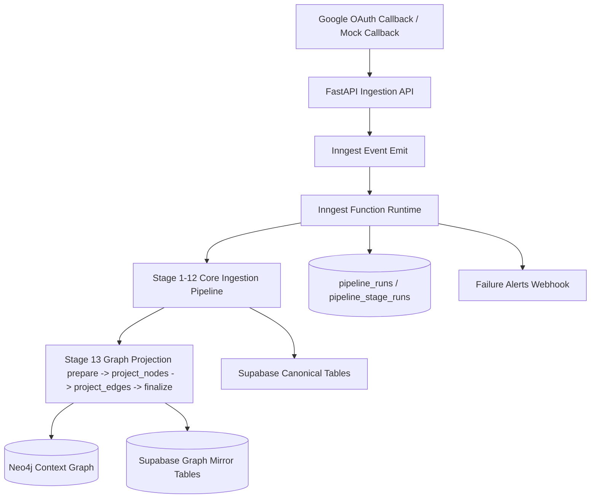
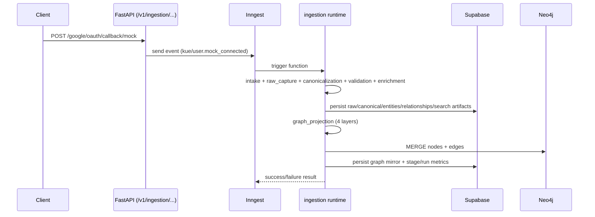

# kue-intelligence

Kue Intelligence is a FastAPI + Inngest ingestion and data-intelligence service that converts raw contact/communication signals into canonical records, entities, relationships, semantic documents, embeddings, hybrid search signals, and graph projections.

This repository currently implements:
- Source ingestion triggers (Google OAuth callback + mock callback)
- End-to-end staged ingestion orchestration with Inngest
- Supabase-backed canonical storage and pipeline observability
- Semantic prep + embedding + hybrid index signal materialization
- Relationship extraction and graph projection stage (compressed 4 layers)

---

## 1) Product Context

Kue turns fragmented professional data into relationship intelligence for:
- NLP search (`"Who do I know at Stripe?"`)
- Relationship strength ranking
- Warm-intro path discovery
- Temporal context (`last_contacted`, interaction history)

System truth model:
- **Postgres/Supabase is source of truth**
- **Neo4j graph is a derived projection**

---

## 2) High-Level Architecture



---

## 3) Runtime Flow (Callback to Pipeline)



---

## 4) Pipeline Stages

## Stage Overview

1. `intake`
2. `orchestration`
3. `raw_capture`
4. `canonicalization`
5. `validation`
6. `cleaning_enrichment`
7. `entity_resolution`
8. `metadata_extraction`
9. `semantic_prep`
10. `embedding`
11. `caching`
12. `search_indexing`
13. `relationship_extraction`
14. `graph_projection` (compressed into 4 layers)

Note: execution ordering in code runs relationship extraction before graph projection and marks run completion at the end.

## Stage 13: Graph Projection (Compressed)

Implemented layers:
1. `stage.graph_projection.layer.prepare`
- Applies Neo4j schema constraints/indexes
- Fetches projection inputs from Supabase
- Builds snapshot + batch stats + checksum

2. `stage.graph_projection.layer.project_nodes`
- Upserts `Person`, `User`, `Company`, `Topic`

3. `stage.graph_projection.layer.project_edges`
- Upserts `KNOWS`, `INTERACTED_WITH`, `WORKS_AT`, `MEMBER_OF`, `HAS_TOPIC`, `INTRO_PATH`

4. `stage.graph_projection.layer.finalize`
- Verifies graph counts vs expected snapshot
- Persists mirror state to Supabase graph projection tables

---

## 5) Data Stores

## Supabase (Canonical + Observability)

Core tables used by runtime include:
- `raw_events`
- `canonical_events`
- `entities`
- `entity_identities`
- `relationships`
- `interaction_facts`
- `search_documents`
- `pipeline_runs`
- `pipeline_stage_runs`
- `ai_call_logs` (schema-ready)

Graph projection mirror tables:
- `graph_projection_runs`
- `graph_projection_nodes`
- `graph_projection_edges`

## Neo4j (Derived Context Graph)

Labels:
- `Person`
- `User`
- `Company`
- `Topic`

Relationships:
- `KNOWS`
- `INTERACTED_WITH`
- `WORKS_AT`
- `MEMBER_OF`
- `HAS_TOPIC`
- `INTRO_PATH`

---

## 6) Repository Structure

```text
app/
  api/
    ingestion_routes.py         # FastAPI endpoints (callbacks, layer/manual endpoints, status)
  core/
    config.py                   # Settings/env model
  ingestion/
    graph_projection.py         # Graph snapshot builder + mirror persistence
    graph_store.py              # Neo4j/no-op graph store
    raw_store.py                # Layer 2 persistence
    canonical_store.py          # Layer 3 persistence
    entity_store.py             # Entity persistence
    relationship_store.py       # Relationship persistence
    search_document_store.py    # Semantic docs persistence
    embedding_store.py          # Embedding persistence
    search_index_store.py       # Hybrid index signal persistence
    pipeline_store.py           # pipeline_runs + pipeline_stage_runs
    ...
  inngest/
    runtime.py                  # Main staged orchestration and Inngest functions
supabase/
  migrations/                   # SQL migrations + RLS + admin reset RPC
tests/                          # Stage and API tests
```

---

## 7) Local Development (uv)

## Prerequisites
- Python 3.11+
- `uv`
- Supabase project (for real persistence path)
- Inngest account/project
- (Optional) Neo4j Aura/local Neo4j

## Install `uv`

```bash
curl -LsSf https://astral.sh/uv/install.sh | sh
```

If `uv` is not found:

```bash
echo 'export PATH="$HOME/.local/bin:$PATH"' >> ~/.zshrc
source ~/.zshrc
```

## Install Dependencies

```bash
uv sync --group dev
uv lock
```

## Configure Environment

```bash
cp .env.example .env
```

Fill required values (minimum):
- App: `APP_ENV`, `APP_HOST`, `APP_PORT`
- Supabase: `SUPABASE_URL`, `SUPABASE_SERVICE_ROLE_KEY`
- Inngest: `INNGEST_EVENT_KEY`, `INNGEST_BASE_URL`, `INNGEST_SOURCE_APP`
- Optional alerts: `ALERT_WEBHOOK_URL`
- Optional graph: `NEO4J_URI`, `NEO4J_USERNAME`, `NEO4J_PASSWORD`, `NEO4J_DATABASE`

## Run API

```bash
uv run uvicorn app.main:app --reload --host 0.0.0.0 --port 8000
```

## Run Tests

```bash
uv run pytest
```

## Makefile shortcuts

```bash
make sync
make run
make test
make lock
```

---

## 8) Inngest Setup

1. Ensure your FastAPI app is reachable by Inngest (local tunnel for local dev).
2. Inngest endpoint is served by:
- `inngest.fast_api.serve(app, inngest_client, inngest_functions)` in `app/main.py`
3. Required function triggers:
- `pipeline/run.requested`
- `kue/user.connected`
- `kue/user.mock_connected`
- `pipeline/stage.canonicalization.replay.requested`

Retries and failure handling:
- Retries controlled by `INNGEST_MAX_RETRIES` (default: `5`)
- Terminal failure calls `on_failure` alert hook (`ALERT_WEBHOOK_URL`)

---

## 9) API Endpoints

## Health
- `GET /health`

## Ingestion triggers
- `POST /v1/ingestion/mock`
- `GET /v1/ingestion/google/oauth/callback`
- `POST /v1/ingestion/google/oauth/callback/mock`

## Stage/event helpers
- `POST /v1/ingestion/layer2/capture`
- `POST /v1/ingestion/stage/canonicalization/replay/{trace_id}`

## Layer-level manual APIs
- `POST /v1/ingestion/layer3/parse/{trace_id}`
- `GET /v1/ingestion/layer3/events/{trace_id}`
- `POST /v1/ingestion/layer4/validate/{trace_id}`
- `POST /v1/ingestion/layer5/enrich/{trace_id}`
- `POST /v1/ingestion/layer6/resolve/{trace_id}`
- `POST /v1/ingestion/layer7/relationships/{trace_id}`
- `POST /v1/ingestion/layer8/metadata/{trace_id}`
- `POST /v1/ingestion/layer9/semantic/{trace_id}`
- `POST /v1/ingestion/layer10/embed/{trace_id}`
- `POST /v1/ingestion/layer11/cache/{trace_id}`
- `POST /v1/ingestion/layer12/index/{trace_id}`

## Ops/admin
- `GET /v1/ingestion/raw-events/{trace_id}`
- `GET /v1/ingestion/pipeline/run/{trace_id}`
- `POST /v1/ingestion/admin/reset` (requires `x-admin-reset-token`)

---

## 10) Example Test Call (Mock Google Callback)

```bash
curl --location 'http://localhost:8000/v1/ingestion/google/oauth/callback/mock' \
--header 'Content-Type: application/json' \
--data '{
  "source_type": "contacts",
  "tenant_id": "tenant_demo",
  "user_id": "user_demo",
  "payload": {
    "connections": [
      {
        "resourceName": "people/c_1",
        "names": [{"displayName": "Alan Turing"}],
        "metadata": {"sources": [{"updateTime": "2025-01-01T10:00:00Z"}]}
      }
    ]
  }
}'
```

Result:
- API emits Inngest event
- Inngest executes full stage flow
- Check status via:

```bash
curl "http://localhost:8000/v1/ingestion/pipeline/run/<trace_id>"
```

---

## 11) Graph Projection Behavior

If Neo4j is configured:
- Stage 13 writes to Neo4j and verifies counts
- Mirror state is written to Supabase graph projection tables

If Neo4j is not configured:
- Stage 13 uses a safe no-op graph store (`graph:disabled`)
- Pipeline still completes

If graph mirror tables are not migrated:
- Stage 13 does not crash the run
- Mirror output reports projection mirror unavailable

---

## 12) Observability and Traceability

Per run:
- `pipeline_runs` tracks run-level status

Per layer:
- `pipeline_stage_runs` tracks stage/layer status, duration, error payload, input/output counts

For graph stage:
- stage keys in Inngest observability are:
  - `graph_projection.prepare`
  - `graph_projection.project_nodes`
  - `graph_projection.project_edges`
  - `graph_projection.finalize`

---

## 13) Migrations

Run Supabase migrations from `supabase/migrations/` in order.

Important migration files:
- Foundation schema + RLS
- Admin reset RPC
- Graph projection tables:
  - `202603040001_graph_projection_tables.sql`

---

## 14) CI

GitHub Actions workflow:
- `.github/workflows/ci.yml`

Steps:
- Setup Python 3.11
- Setup uv
- `uv sync --group dev`
- `uv run pytest`

---

## 15) Common Troubleshooting

## `uv` not found
Add path and reload shell:

```bash
echo 'export PATH="$HOME/.local/bin:$PATH"' >> ~/.zshrc
source ~/.zshrc
```

## Inngest sync rejected (`Dev Server vs Cloud`)
Check `INNGEST_BASE_URL`, signing key usage, and ensure local/cloud modes are matched.

## Supabase duplicate key conflicts
Idempotency keys are expected (`trace_id`, source event unique keys). Replays should upsert/update existing rows.

## Graph stage not writing to Neo4j
Verify:
- `NEO4J_URI`
- `NEO4J_USERNAME`
- `NEO4J_PASSWORD`
- Network reachability from runtime

## Tests fail due to missing deps
Run:

```bash
uv sync --group dev
```

---

## 16) Security Notes

- Do not expose service-role keys to client apps.
- Keep admin reset token secret.
- Keep raw payload tables backend-only under RLS.
- Use tenant-scoped access policies in Supabase.

---

## 17) Current Status Snapshot

Implemented and working in repo:
- Stage orchestration through graph projection
- Compressed Stage 13 graph layers (4)
- uv-based local workflow + CI workflow
- Full automated tests passing locally with uv

