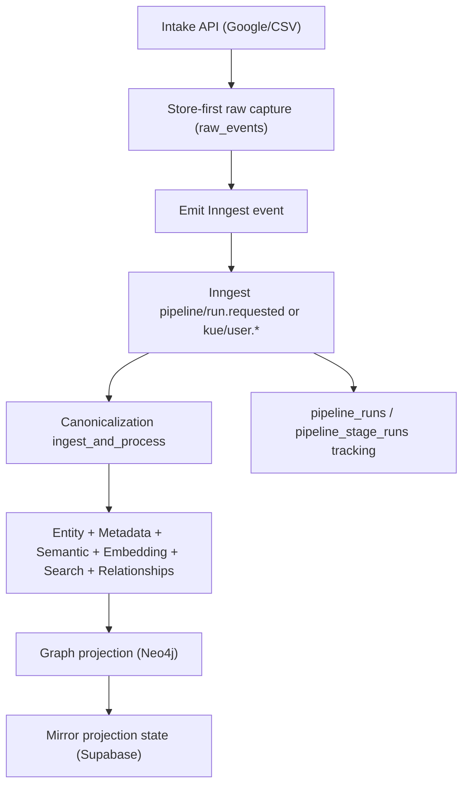

# Kue Intelligence Ingestion Pipeline

This document describes the ingestion pipeline that is currently implemented in `kue-intelligence`.

It is intentionally comprehensive but simple: what comes in, what each stage does, where data is stored, and how to operate/debug it.

## 1) What This Pipeline Does

The ingestion system turns external data sources into tenant-scoped intelligence artifacts for search and graph use cases.

Implemented intake sources:
- Google OAuth callback (`contacts`, `gmail`, `calendar`)
- Google mock callback (for integration testing)
- CSV import (`linkedin`, `csv_import`, `google_contacts` hints)

Pipeline outputs:
- Raw source events
- Canonical normalized events
- Resolved entities and relationships
- Metadata and semantic documents
- Embeddings and search indexing signals
- Neo4j graph projection + mirror state in Supabase
- Full stage observability for every run

## 2) High-Level Flow



## 3) Runtime Architecture

Core orchestration modules:
- `/Users/harunrashid/Documents/Personal/kue-intelligence/app/inngest/runtime.py`
- `/Users/harunrashid/Documents/Personal/kue-intelligence/app/inngest/pipeline.py`
- `/Users/harunrashid/Documents/Personal/kue-intelligence/app/inngest/layers.py`
- `/Users/harunrashid/Documents/Personal/kue-intelligence/app/inngest/operations.py`

HTTP intake + manual APIs:
- `/Users/harunrashid/Documents/Personal/kue-intelligence/app/api/ingestion_routes.py`

## 4) Inngest Functions (Implemented)

1. `ingestion-pipeline-run`
- Trigger: `pipeline/run.requested`
- Use case: store-first runs (raw events already persisted)

2. `ingestion-user-connected`
- Trigger: `kue/user.connected`
- Use case: real Google OAuth callback path

3. `ingestion-user-mock-connected`
- Trigger: `kue/user.mock_connected`
- Use case: mock Google payload path

4. `ingestion-stage-canonicalization-replay`
- Trigger: `pipeline/stage.canonicalization.replay.requested`
- Use case: replay canonicalization and downstream stages for an existing trace

## 5) Stage and Layer Breakdown

Current stage keys and layer keys recorded in `pipeline_stage_runs`:

1. `intake`
- `validate_payload`
- `fetch_google` or `fetch_mock`

2. `orchestration`
- `ensure_run`
- `complete_run`
- `fail_run`

3. `raw_capture`
- `validate`
- `persist`

4. `canonicalization`
- `ingest_and_process` (compressed layer)
  - fetch raw events
  - parse raw events
  - schema validation
  - cleaning/enrichment
  - canonical persistence
  - compute entity/metadata/semantic/relationship intermediates
  - offload large intermediate payload to `step_payloads`

5. `entity_resolution`
- `persist_entities`

6. `metadata_extraction`
- `persist_metadata`

7. `semantic_prep`
- `persist_search_documents`

8. `embedding`
- `generate_vectors`
- `persist_vectors`

9. `search_indexing`
- `build_signals`
- `index_health_check`

10. `relationship_extraction`
- `persist_relationships`

11. `graph_projection`
- `prepare`
- `project`
- `finalize`

## 6) Data Stores and Main Tables

Supabase/Postgres:
- `raw_events` (store-first source capture)
- `canonical_events` (normalized canonical records)
- `entities`
- `relationships`
- `interaction_facts`
- `entity_metadata`
- `search_documents`
- `embedding_vectors`
- `search_index_signals`
- `source_connections`
- `pipeline_runs`
- `pipeline_stage_runs`
- `step_payloads`
- `graph_projection_runs`
- `graph_projection_nodes`
- `graph_projection_edges`

Neo4j (derived projection):
- Node labels: `Person`, `User`, `Company`, `Topic`
- Relationship types include: `KNOWS`, `INTERACTED_WITH`, `WORKS_AT`, `MEMBER_OF`, `HAS_TOPIC`, `INTRO_PATH`

## 7) Store-First Pattern (Important)

The production pattern used here is store-first:

1. Intake endpoint validates request.
2. Run is created in `pipeline_runs`.
3. Raw source events are persisted to `raw_events`.
4. Compact Inngest event is emitted (`pre_stored=true`, `run_id`, `trace_id`, counts).
5. Pipeline reads from stored data and executes asynchronously.

Why:
- More reliable than pushing big payloads through event bus
- Better replay/debug support
- Avoids event size limits

## 8) CSV and LinkedIn Import (MVP)

Implemented endpoints:
- `POST /v1/ingestion/import/csv`
- `POST /v1/ingestion/import/csv/mock`

Behavior:
- Template detection + header normalization
- Mapping fallback for unknown headers
- Row-level warning collection
- Hard fail if no valid rows
- Soft skip invalid rows when at least one valid row exists
- Upserts `source_connections` for csv-based source tracking
- Persists normalized rows as `SourceEvent` into `raw_events`
- Emits `pipeline/run.requested` for async processing

Implementation file:
- `/Users/harunrashid/Documents/Personal/kue-intelligence/app/ingestion/csv_import.py`

## 9) Observability and Failure Handling

Run-level tracking:
- `pipeline_runs`: lifecycle (`running/succeeded/failed`), source, trigger, timing, metadata

Layer-level tracking:
- `pipeline_stage_runs`: per-layer status, timing, record counts, errors

Large payload handling:
- `step_payloads` stores intermediate stage outputs to prevent Inngest step-size overflow

Retry + alerting:
- Inngest function retries are configured by `INNGEST_MAX_RETRIES` (default `5`)
- `on_failure` hook sends webhook alert if `ALERT_WEBHOOK_URL` is set, else logs failure
- Failure hook is implemented in `/Users/harunrashid/Documents/Personal/kue-intelligence/app/inngest/client.py`

## 10) Key API Endpoints

Intake:
- `GET /v1/ingestion/google/oauth/callback`
- `POST /v1/ingestion/google/oauth/callback/mock`
- `POST /v1/ingestion/import/csv`
- `POST /v1/ingestion/import/csv/mock`

Manual stage/debug:
- `POST /v1/ingestion/layer2/capture`
- `POST /v1/ingestion/stage/canonicalization/replay/{trace_id}`
- `GET /v1/ingestion/raw-events/{trace_id}`
- `GET /v1/ingestion/pipeline/run/{trace_id}`

Ops:
- `POST /v1/ingestion/admin/reset` (requires `x-admin-reset-token`)

## 11) Required Environment Variables

Base:
- `APP_ENV`, `APP_HOST`, `APP_PORT`

Google:
- `GOOGLE_OAUTH_CLIENT_ID`
- `GOOGLE_OAUTH_CLIENT_SECRET`
- `GOOGLE_OAUTH_REDIRECT_URI`

Supabase:
- `SUPABASE_URL`
- `SUPABASE_SERVICE_ROLE_KEY`

Inngest:
- `INNGEST_BASE_URL`
- `INNGEST_EVENT_KEY` (cloud)
- `INNGEST_SIGNING_KEY` (cloud)
- `INNGEST_MAX_RETRIES`
- `ALERT_WEBHOOK_URL` (optional)

Neo4j (optional but needed for graph projection writes):
- `NEO4J_URI`
- `NEO4J_USERNAME`
- `NEO4J_PASSWORD`
- `NEO4J_DATABASE`

## 12) How to Run Locally

1. Install dependencies:
```bash
uv sync
```

2. Start Inngest Dev Server:
```bash
npx inngest-cli@latest dev
```

3. Run API:
```bash
uv run uvicorn app.main:app --reload --port 8000
```

4. Trigger a mock ingestion:
```bash
curl -X POST http://localhost:8000/v1/ingestion/google/oauth/callback/mock \
  -H "Content-Type: application/json" \
  -d '{
    "source_type":"contacts",
    "tenant_id":"tenant_demo",
    "user_id":"user_demo",
    "payload":{"connections":[{"resourceName":"people/c_1","names":[{"displayName":"Alan Turing"}]}]}
  }'
```

5. Check run status:
```bash
curl "http://localhost:8000/v1/ingestion/pipeline/run/<trace_id>"
```

## 13) What Is Implemented vs Pending

Implemented:
- Google callback + mock callback intake
- CSV/LinkedIn-import intake (CSV based)
- Store-first raw capture
- Canonicalization pipeline
- Entity/metadata/semantic/embedding/search/relationship stages
- Neo4j graph projection with finalize verification + mirror persistence
- Retry and failure alert hook
- Manual/replay endpoints and tests

Potential future expansion:
- Scheduled polling and webhook-driven incremental sync for each provider
- Additional source connectors (Twitter, LinkedIn API, Slack, etc.)
- Advanced graph analytics and proactive opportunity detection stages

---

If you want, this doc can be split next into:
- an operator runbook (`docs/INGESTION_RUNBOOK.md`)
- and a developer extension guide (`docs/INGESTION_EXTENDING.md`).
