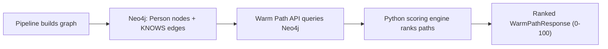

# Warm Path Engine

The warm path engine finds the best introduction paths through a user's professional network. Given a graph of people connected by `KNOWS` relationships (built from email, calendar, and other interaction data), it answers two questions:

1. **"How do I reach person X?"** — Find the strongest paths from me to a specific target.
2. **"Who can I reach most effectively?"** — Discover the warmest reachable people in my network.

## Architecture

The warm path feature is a **query-time** layer that sits on top of the existing pipeline. It does not add a new pipeline stage — instead, it reads from the Neo4j graph that the pipeline already builds and scores paths on the fly.



### Key modules

| Module | Role |
|--------|------|
| `app/ingestion/warm_path.py` | Scoring functions, tiebreakers, deduplication, caching, `WarmPathService` |
| `app/api/warm_path_routes.py` | REST endpoints (`/v1/warm-path/`) |
| `app/ingestion/warm_path_event_store.py` | Event persistence (SQLite + Supabase) |
| `app/schemas.py` | `WarmPath*` Pydantic models |
| `app/ingestion/graph_store.py` | `run_read_query()` — read-only Neo4j access with 10s timeout |

## Scoring Model (PRD Section 4.2)

Each edge in a path gets a **warmth score** combining five weighted signals:

```
edge_warmth = 0.40 * strength
            + 0.05 * recency
            + 0.25 * frequency
            + 0.15 * channel_diversity
            + 0.15 * reliability
```

| Signal | Weight | Source | Formula | Range |
|--------|--------|--------|---------|-------|
| **Strength** | 40% | `KNOWS.strength` | Passed through directly (`min(1.0, interactions/10)`) | 0–1 |
| **Recency** | 5% | `KNOWS.last_interaction_at` | `exp(-days_since / 90)` — 90-day half-life | 0–1 |
| **Frequency** | 25% | `KNOWS.interaction_count` | `min(1.0, ln(1+count) / ln(11))` — saturates at 10 | 0–1 |
| **Channel diversity** | 15% | `KNOWS.channels` | `min(1.0, unique_channels / 3)` — full score at 3+ | 0–1 |
| **Reliability** | 15% | Placeholder | Default `0.5` until `intro_outcomes` tracking is implemented | 0–1 |

The **path score** is the product of all edge warmths, with a per-hop decay, scaled to **0–100**:

```
path_score = (edge_1 * edge_2 * ... * edge_n) * 0.85^(hops - 1) * 100
```

This means:
- A direct connection (1 hop) has no penalty.
- A 2-hop path gets multiplied by `0.85`.
- A 3-hop path gets multiplied by `0.7225`.
- Score `87` means "87% likely to result in a successful intro" (PRD Section 4.3).

All weights and constants are defined as module-level constants in `warm_path.py` for easy tuning.

### Reliability placeholder

The reliability signal (15% weight) currently uses a static default of `0.5` for all connectors. When the `intro_outcomes` table and tracking pipeline are implemented in a future PR, this will be replaced with a per-connector reliability score based on historical intro success data.

## Ranking, Tiebreakers, and Deduplication

### Tiebreaker logic (PRD Section 7)

When two paths have equal scores:
1. **Shorter path preferred** — fewer hops = higher reliability
2. **Most recent connector interaction preferred** — more recently active connector is more likely to respond

### Connector deduplication (PRD Section 7)

> "A connector appears in multiple paths → Show them once in the recommended path. Do not show them again in alternatives — surface different connectors for diversity."

After ranking, alternative paths are filtered so that each path must introduce at least one connector not already seen in higher-ranked paths. Direct (1-hop) paths are always kept regardless.

### `is_direct` flag

Each path includes an `is_direct: bool` field. When `true` (hop_count == 1), the frontend should render "You know them directly" instead of the path diagram (PRD Section 4.4).

## Disconnected connector filtering

Cypher queries include a filter: `ALL(n IN nodes(path) WHERE coalesce(n.is_active, true) = true)`. When a user disconnects from Kue and their Person node has `is_active = false`, they are immediately excluded from all path recommendations (PRD acceptance criteria).

## API Reference

Base path: `/v1/warm-path`

### Find paths to a specific target

```
GET /v1/warm-path/{tenant_id}/to/{target_entity_id}
```

| Parameter | Location | Required | Default | Description |
|-----------|----------|----------|---------|-------------|
| `tenant_id` | path | yes | — | Tenant scope |
| `target_entity_id` | path | yes | — | Target person's entity ID |
| `origin_entity_id` | query | yes | — | Your entity ID (the starting person) |
| `max_hops` | query | no | 3 | Path depth limit (1–3) |
| `max_paths` | query | no | 5 | Max paths to return (1–20) |

**Example:**

```bash
curl "http://localhost:8000/v1/warm-path/tenant_1/to/ent_target_123?origin_entity_id=ent_me_456&max_paths=3"
```

### Discover warmest reachable people

```
GET /v1/warm-path/{tenant_id}/discover
```

| Parameter | Location | Required | Default | Description |
|-----------|----------|----------|---------|-------------|
| `tenant_id` | path | yes | — | Tenant scope |
| `origin_entity_id` | query | yes | — | Your entity ID |
| `max_hops` | query | no | 3 | Path depth limit (1–3) |
| `max_paths` | query | no | 20 | Max paths to return (1–50) |
| `min_score` | query | no | 0.0 | Minimum path score filter (0–100) |

**Example:**

```bash
curl "http://localhost:8000/v1/warm-path/tenant_1/discover?origin_entity_id=ent_me_456&max_paths=10&min_score=30"
```

### Resolve email to entity ID

A convenience endpoint to look up a person's `entity_id` from their email address.

```
GET /v1/warm-path/{tenant_id}/resolve-origin
```

| Parameter | Location | Required | Description |
|-----------|----------|----------|-------------|
| `tenant_id` | path | yes | Tenant scope |
| `email` | query | yes | Email to resolve |

**Example:**

```bash
curl "http://localhost:8000/v1/warm-path/tenant_1/resolve-origin?email=alice@example.com"
```

### Log path interaction event (feedback loop)

Records path selections, intro requests, and outcomes for future ranking improvements.

```
POST /v1/warm-path/{tenant_id}/events
```

**Request body:**

```json
{
  "event_type": "path_selected",
  "origin_entity_id": "ent_origin",
  "target_entity_id": "ent_target",
  "selected_path_score": 72.5,
  "selected_path_hop_count": 2,
  "connector_entity_ids": ["ent_connector_1"],
  "metadata": {"source": "search_results"}
}
```

Supported `event_type` values:
- `path_selected` — User selected a specific path from the alternatives
- `intro_requested` — User clicked "Request Intro" for a path
- `intro_outcome` — (Future) Outcome tracking for the intro

**Response:**

```json
{
  "tenant_id": "tenant_1",
  "event_id": "uuid-here",
  "event_type": "path_selected",
  "recorded_at": "2026-03-15T10:00:00+00:00"
}
```

## Response Schema

All path endpoints return a `WarmPathResponse`:

```json
{
  "tenant_id": "tenant_1",
  "origin_entity_id": "ent_me",
  "target_entity_id": "ent_target",
  "query_mode": "targeted",
  "total_paths_found": 2,
  "paths": [
    {
      "hop_count": 1,
      "path_score": 82.34,
      "is_direct": true,
      "path_nodes": [
        {"entity_id": "ent_me", "name": "Alice", "primary_email": "alice@co.com", "company": "co.com"},
        {"entity_id": "ent_target", "name": "Bob", "primary_email": "bob@other.com", "company": "other.com"}
      ],
      "path_edges": [
        {
          "from_entity_id": "ent_me",
          "to_entity_id": "ent_target",
          "strength": 0.8,
          "interaction_count": 8,
          "last_interaction_at": "2026-03-10T14:00:00+00:00",
          "channels": ["email", "meeting"],
          "edge_warmth": 0.8234
        }
      ]
    },
    {
      "hop_count": 2,
      "path_score": 31.02,
      "is_direct": false,
      "path_nodes": [
        {"entity_id": "ent_me", "name": "Alice", "primary_email": "alice@co.com", "company": "co.com"},
        {"entity_id": "ent_carol", "name": "Carol", "primary_email": "carol@co.com", "company": "co.com"},
        {"entity_id": "ent_target", "name": "Bob", "primary_email": "bob@other.com", "company": "other.com"}
      ],
      "path_edges": [
        {
          "from_entity_id": "ent_me",
          "to_entity_id": "ent_carol",
          "strength": 0.6,
          "interaction_count": 5,
          "last_interaction_at": "2026-03-12T10:00:00+00:00",
          "channels": ["email"],
          "edge_warmth": 0.6512
        },
        {
          "from_entity_id": "ent_carol",
          "to_entity_id": "ent_target",
          "strength": 0.5,
          "interaction_count": 3,
          "last_interaction_at": "2026-03-08T09:00:00+00:00",
          "channels": ["meeting"],
          "edge_warmth": 0.5601
        }
      ]
    }
  ]
}
```

## How It Works Under the Hood

1. **Graph traversal** — Neo4j executes a variable-length `KNOWS*1..N` path query with cycle prevention and disconnected-connector filtering.
2. **Raw results** — Cypher returns path nodes and edge properties (strength, interaction_count, last_interaction_at, channels).
3. **Python scoring** — Each edge gets a warmth score using the 5-signal formula. Path scores are computed as the product of edge warmths with hop decay, scaled to 0–100.
4. **Ranking** — Paths are sorted by score DESC, then hop_count ASC, then recency DESC (tiebreakers).
5. **Deduplication** — Alternative paths are filtered to ensure connector diversity.
6. **Truncation** — Results are truncated to `max_paths`.

Scoring is done in Python (not Cypher) so the logic is unit-testable and the formula can evolve without touching queries.

## Performance

- **Max hops hard-capped at 3.** Variable-length paths beyond 3 hops are combinatorially expensive and practically useless for warm introductions.
- **Max paths hard-capped at 50.** The `LIMIT` clause in Cypher stops traversal early.
- **10-second query timeout.** Neo4j read queries have a 10s timeout. If exceeded, the API returns HTTP 504 with a message suggesting the user reduce `max_hops`.
- **Cycle prevention** in Cypher prevents exponential path explosion.
- **Disconnected connector filtering** at the Cypher level prevents inactive nodes from appearing in results.
- **Existing indexes** on `(tenant_id, entity_id)` for Person nodes and `tenant_id` for KNOWS edges ensure fast lookups.
- **No Neo4j = empty results.** When Neo4j is not configured (`NoopGraphStore`), all endpoints return empty path lists gracefully.

### Query caching

Query results are cached to avoid redundant Neo4j round-trips. The cache uses an ABC (`WarmPathCache`) with two implementations:

- **`UpstashRedisWarmPathCache`** (primary) — Upstash Redis REST API. Used when `UPSTASH_REDIS_REST_URL` and `UPSTASH_REDIS_REST_TOKEN` are configured. All keys are namespaced under `warm_path:` and use Redis-native TTL. Shared across processes/instances.
- **`InMemoryWarmPathCache`** (fallback) — Thread-safe in-memory LRU cache. Used when Redis is not configured. Per-process only.

The factory `create_warm_path_cache(settings)` selects the implementation automatically.

- **TTL**: 300 seconds (configurable via `WARM_PATH_CACHE_TTL_SECONDS`)
- **Max size**: 256 entries, in-memory only (configurable via `WARM_PATH_CACHE_MAX_SIZE`)
- **Per-tenant invalidation**: Call `WarmPathService.invalidate_tenant_cache(tenant_id)` after a pipeline run refreshes the network data. This evicts all cached entries for that tenant (uses `SCAN` + `DELETE` on Redis).
- Network size checks (for large network optimization) are also cached to avoid repeated COUNT queries.

### Large network optimization

For tenants with more than 10,000 Person nodes, the engine automatically switches to strength-filtered Cypher queries that only traverse `KNOWS` edges with `strength >= 0.3`. This dramatically reduces the search space for combinatorial path traversal.

- **Threshold**: 10,000 Person nodes (configurable via `WARM_PATH_LARGE_NETWORK_THRESHOLD`)
- **Minimum strength**: 0.3 (configurable via `WARM_PATH_LARGE_NETWORK_MIN_STRENGTH`)
- The network size is checked once per tenant and cached. The switch is transparent to the caller — the same API endpoints work for all network sizes.

## Configuration

Settings in `app/core/config.py` (or via environment variables):

| Setting | Default | Description |
|---------|---------|-------------|
| `WARM_PATH_MAX_HOPS` | 3 | Default max hops |
| `WARM_PATH_MAX_RESULTS` | 20 | Default max paths for discover |
| `WARM_PATH_RECENCY_HALFLIFE_DAYS` | 90.0 | Recency decay half-life |
| `WARM_PATH_HOP_DECAY` | 0.85 | Per-hop penalty multiplier |
| `WARM_PATH_CACHE_TTL_SECONDS` | 300 | Query cache TTL in seconds |
| `WARM_PATH_CACHE_MAX_SIZE` | 256 | Max entries in query cache |
| `WARM_PATH_LARGE_NETWORK_THRESHOLD` | 10000 | Person count above which strength-filtered queries are used |
| `WARM_PATH_LARGE_NETWORK_MIN_STRENGTH` | 0.3 | Minimum edge strength for large network queries |
| `UPSTASH_REDIS_REST_URL` | _(empty)_ | Upstash Redis REST URL; enables Redis cache when set |
| `UPSTASH_REDIS_REST_TOKEN` | _(empty)_ | Upstash Redis REST token |

## Relationship to INTRO_PATH

The pipeline's graph projection stage (`graph_projection.py`) has an older `INTRO_PATH` calculation that computes 2-hop paths with simple `strength * strength` scoring. This is **deprecated** in favor of the warm path engine. The old code is kept for backward compatibility and will be removed in a follow-up PR.

## Event Persistence

The `POST /events` endpoint persists warm-path interaction events (path selections, intro requests, outcomes) for the feedback loop. Events are stored using the same ABC store pattern as other data stores:

- **Supabase** (`SupabaseWarmPathEventStore`) — used when `SUPABASE_URL` and an API key are configured.
- **SQLite** (`SqliteWarmPathEventStore`) — fallback for local development, stored in the pipeline DB.

Events are persisted asynchronously — if the store write fails, the error is logged but the API still returns a successful response. This prevents persistence failures from blocking the frontend.

The event store is defined in `app/ingestion/warm_path_event_store.py` and wired into the routes via `create_warm_path_event_store(settings)`.

## Future work

- **Connector reliability** — Replace the static `0.5` default with per-connector reliability scores tracked via an `intro_outcomes` table.
- **Pre-computation** — Pre-compute paths for top 50 most-viewed contacts per user for instant responses.
- **Cache warming on pipeline completion** — Hook into the pipeline completion event to pre-warm the cache for active users.

## Testing

```bash
# Run warm path tests only
uv run pytest tests/test_warm_path.py -v

# Run full suite
make test
```

Tests cover (48 tests total):
- All 5 scoring functions (recency, frequency, channel diversity, reliability, edge warmth)
- Path score computation with hop decay and 0–100 scaling
- Tiebreaker logic (shorter path, more recent interaction)
- Connector deduplication across alternative paths
- `is_direct` flag
- All 4 REST endpoints (targeted, discover, resolve-origin, events)
- Edge cases (no Neo4j, min_score filtering, invalid params, missing fields)
- TTL cache (put/get, eviction, expiry, tenant invalidation, clear)
- Service-level caching (cache hit avoids Neo4j, invalidation forces re-query)
- Large network optimization (strength-filtered queries for large networks, normal queries for small)
- Event persistence (events stored via SQLite fallback in tests)
